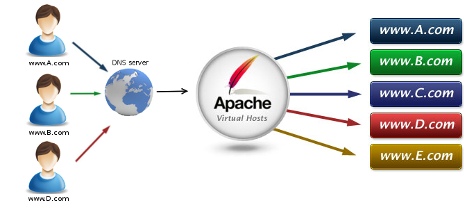

# Apache - VirtualHosts 
<br>


<br>

O suporte a virtual hosts é um daqueles recursos fundamentais, que possibilitaram o surgimento da Internet da forma como a conhecemos hoje.
Ele permite hospedar diversos sites, com domínios ou subdomínios diferentes usando um único servidor e um único endereço IP. Os únicos limitantes com relação ao volume de sites que é possível hospedar são os recursos de hardware do servidor e a banda disponível.

#### Vamos criar uma estrutura para receber nosso host virtual

```shell
sudo mkdir -p /var/www/html/idss.local/public_html # -p cria a hierarquia
sudo mkdir /var/www/html/idss.local/logs
```

#### Criamos agora um arquivo de chamada para ids

```shell
sudo vim /etc/apache2/sites-available/idss.conf
```

#### Dentro deste arquivo colocamos a seguinte descrição

```html
<VirtualHost *:8081> 
    ServerAdmin webmaster@ids.local
    ServerName idss.local
    ServerAlias www.idss.local
    DocumentRoot /var/www/html/idss.local/public_html/
    ErrorLog /var/www/html/idss.local/logs/error.log
    CustomLog /var/www/html/idss.local/logs/access.log combined
</VirtualHost>
```

Abra o arquivo para configurar que portas o apache esta escutando

```shell
sudo vim /etc/apache2/ports.conf
```

Coleque o "Listen 8081" abaixo do "Listen 80"

### Salvar e fechar este arquivo

#### Não esqueçam de liberar a porta 8081 no **SecurityGroup** AWS

------

### Vamos conceder as permissões

```shell
$ sudo chown -R $USER:$USER  /var/www/html/idss.local/public_html
$ sudo chmod -R 755  /var/www/html/
```

**<u>$USER → Variável de ambiente que representa nome do usuário logado</u>**

#### Criamos um arquivo de exemplo para ids

```shell
$ sudo vim  /var/www/html/idss.local/public_html/index.html
```

#### Dentro deste arquivo colocamos a seguinte descrição

```html
<html>
	<head>
		<title>Bem Vindo ao IDSS5 - 2024!</title>
		<meta charset="UTF-8">
	</head>
	<body>
		<h1>Parabéns!  O seu virtual host está funcionando!</h1>
	</body>
</html>
```

#### Agora criamos um link simbólico, que pode ser feito de varias formas, veja uma.

Para criar e habilitar usamos **a2ensite**

```shell
$ sudo a2ensite idss.local.conf # habilita nosso VirtualHost
```

Para desabilitar o link simbólico usamos **a2dissite** <MARK>(**Não é necessário desabilitar os sites, a não ser que esteja desativando algum**)</MARK>
```shell
$ sudo a2dissite idss.local.conf # só execute, quando for necessario desabilitar
```

Desativem o principal, caso queiram deixar apenas o *virtualhost*:
```shell
$ sudo a2dissite 000-default.conf # para que o virtualhost execute na página principal
```


### Restart o serviço apache2

```shell
$ sudo service apache2 restart
```

### <u>Sempre que fizer uma mudança da configuração, não esqueça de reiniciar o serviço</u>

<p align="right">
<a href="04-LAMP.md">
     
  <br>
  LAMP
  </a>
</p> 
<p align="left">
<a href="https://github.com/birazn/IDS-IFSPVTP#sumário">
    
  <br>
  Sumário
</a>
</p>

---
## Dúvidas?

[@birazn](https://www.instagram.com/birazn)

[Canal YouTube](https://www.youtube.com/birazn)

