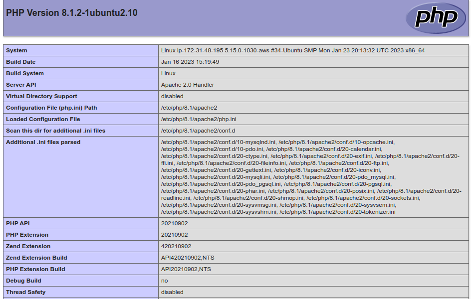
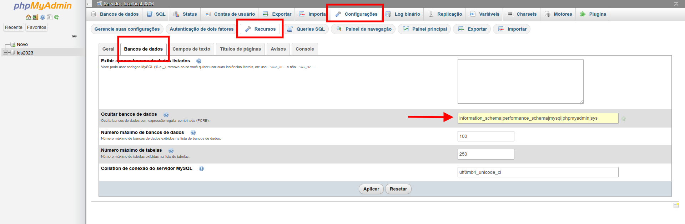

# Instalando e Configurando LAMP 

<br>

<div align="center"></div>

Uma stack LAMP é um pacote de, no mínimo, quatro tecnologias de software diferentes que os desenvolvedores usam para criar sites e aplicativos web. LAMP é um acrônimo para o sistema operacional **Linux**; o servidor web, **Apache**; o servidor de banco de dados, **MySQL**; e a linguagem de programação, **PHP**.

## Atualizando repositórios

```bash
$ sudo apt update
$ sudo apt upgrade
```

> ***É importante que o Servidor Web já esteja instalado e configurado. Neste caso, estamos usando o Apache 2.***

---

<div align="center"></div>

# PHP

É o interpretador que torna possível a execução de paginas dinâmicas e interativa usando seus próprios scripts e frameworks.

**(para Ubuntu 22.04 – verificando a versão PHP)**

```bash
$ sudo apt install libapache2-mod-php8.1 php8.1 php8.1-mysql php8.1-pgsql
```

**(para versões diferentes verifique a versão do PHP)**

> Notem que o X apresentado na versão '8.X' é para indicar que as versões pode ser diferentes, dependendo da distro e do tempo de lançamento dela.

Criar o diretório de log para PHP e dar permissão do usuário Apache:

```bash
$ sudo mkdir /var/log/php
$ sudo chown www-data /var/log/php
```

**(<u>www-data</u> é usuário do apache)**

Crie um arquivo funcionalidades.

```bash
$ sudo vim /var/www/html/phpinfo.php
```

```php
<?php
phpinfo();
?>
```

**Se funcionar siga para o próximo passo**

http://ip_do_servidor/phpinfo.php

<div align="center"></div>

<hr>

<div align="center"></div>

## MySQL

O MySQL é um sistema de gerenciamento de banco de dados relacional (SGBDR) e é um componente popular de muitas aplicações.

```bash
$ sudo apt install mysql-server
```

#### Verificando serviço

```bash
$ sudo service mysql status # forma convencional
# ou
$ sudo systemctl status mysql # forma mais atual
```

#### Logando como root sem senha inicial

```bash
$ sudo mysql
```

**Deve cair em um prompt**

```bash
mysql>
```

Se você quiser fazer login como root através de programas externos, como o **phpMyAdmin**, você tem duas opções:

**A primeira opção é alterando o método de autenticação do usuário root:**

```sql
ALTER USER 'root'@'localhost' IDENTIFIED WITH mysql_native_password BY 'senha_da_nasa';
FLUSH PRIVILEGES;
```

**E a segunda e recomendada é criar um usuário administrativo com acesso a todos os bancos de dados, sem alterar o método de autenticação do root:** <mark>(indicada)</mark> 

```sql
CREATE USER 'ids'@'localhost' IDENTIFIED BY 'senha_da_nasa';
GRANT ALL PRIVILEGES ON *.* TO 'ids'@'localhost' WITH GRANT OPTION;

CREATE DATABASE ids2023;
CREATE USER 'idslim'@'localhost' IDENTIFIED BY 'senha_da_nasa';
GRANT ALL ON ids2023.* TO 'idslim'@'localhost' WITH GRANT OPTION;
```

> **Caso queira liberar acesso remoto para outros programas**

```bash
$ sudo vim /etc/mysql/mysql.conf.d/mysqld.cnf
```

Comente a linha do **bind-address**

Repita a linha do GRANT ALL trocando localhost pelo IP do servidor.
Não esqueça de Liberar no SecurityGroup 3306

---

<div align="center"></div>

## PHP MyAdmin

```bash
$ sudo apt install phpmyadmin
```

Marcar a opção do servidor web que está utilizando com **Apache**. [***<u>Selecione com barra de espaço</u>***]

Configurar o banco integrando com phpmyadmin.

Para acessar o phpmyadmin acesse o endereço local ou <u>http://IP-do-servidor/phpmyadmin</u> que terá que abrir.


### Ocultando tabelas de configuração

Com o PHPMyAdmin aberto, siga os passos

Configurações > Recursos > Banco de Dados



Inclua a lista de nomes do banco de dados que deseja ocultar, separados por | [pipe].

<hr>

#### Após a instalação <b>[Opcional]</b>

> para remover o banco de dados de teste e quaisquer permissões de usuário estranhos adicionados durante o processo inicial de instalação, para configurar e melhorar a segurança do seu servidor MySQL

```bash
$ sudo mysql_secure_installation
```

Esta configuração, exibirá a opção **<mark>VALIDATE PASSWORD <u>COMPONENT</u></mark>** usada como validação de senhas fortes para usuários do MySQL. 

Pedirá a senha do **root** configurada anteriormente;
Mostra informações sobre o componente;
A <u>força da senha</u> será testada;

- Oferece possibilidade de alterar senha do **root** (**n**);
- Remover usuário anônimo **sim (Y)**;
- Remover acesso remoto **sim (Y)**; <mark>(tira acesso remoto com root)</mark>
- Remover banco de dados de teste **sim (Y)**;
- recarregar privilégios agora **sim (Y)**.

<hr>
# Caso necessite desabilitar a validação.

## MySQL 5.7 version

Login to MySQL :

```bash
sudo mysql -u root -p
Enter Password:

mysql> uninstall plugin validate_password;
Query OK, 0 rows affected (0.02 sec)
```
Habilitar novamente
```bash
sudo mysql -u root -p
Enter Password:

mysql> install plugin validate_password SONAME 'validate_password.so';
Query OK, 0 rows affected (0.02 sec)
```

Verificar se funcionou.

```bash
vim /etc/my.cnf
validate_password_policy=LOW
```

## MySQL 8.0 version

Login to MySQL :

```bash
sudo mysql -u root -p
Enter Password:

mysql>UNINSTALL COMPONENT 'file://component_validate_password';
Query OK, 0 rows affect
```

Habilitar novamente
```bash
sudo mysql -u root -p
Enter Password:

mysql>INSTALL COMPONENT 'file://component_validate_password';
Query OK, 0 rows affected (0.02 sec)
```

---

## Dúvidas?

[@birazn](https://www.instagram.com/birazn)

[Canal YouTube](https://www.youtube.com/birazn)


---

<a href="https://github.com/birazn/IDS-IFSPVTP#sum%C3%A1rio">

</a>
 <p style="float:right" align="center">
  <a href="05-Paginas_Pessoais.md">
     
  </a>
  <br>
  Páginas Pessoais
</p> 